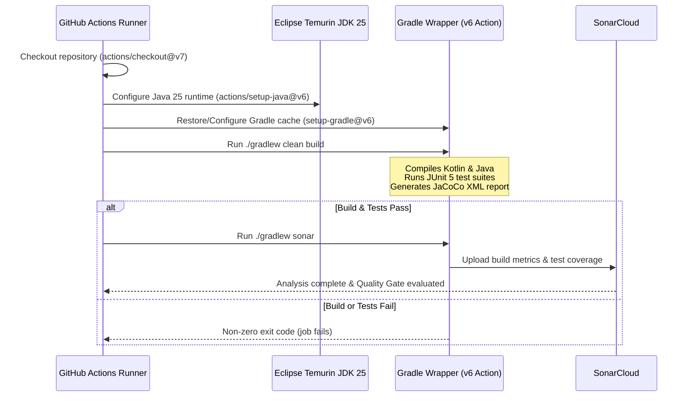

# Project Build & Quality Analysis Workflow (`gradle.yml`)

## Overview

The `gradle.yml` workflow is the continuous integration pipeline for the application. It triggers on every push to build
the project with Gradle and JDK 25, run the automated test suite, generate code coverage metrics via JaCoCo, and upload
code quality and security analyses to SonarCloud.

---

## Triggers

1. **Push**:
    - `on: [ push ]`
    - Executes on any commit pushed to any branch or tag in the repository.

---

## Repository Requirements & Secrets

For SonarCloud static analysis to execute and report back to GitHub:

1. **`SONAR_TOKEN`**:
    - A secret token generated from [SonarCloud](https://sonarcloud.io) for the `admiral-bulldog-sounds` organization.
    - Must be configured in repository settings under **Settings** > **Secrets and variables** > **Actions** >
      **Repository secrets**.

2. **`GITHUB_TOKEN`**:
    - The standard automated GitHub Actions token provided automatically by the runner environment.
    - Used by SonarCloud for PR decoration and repository metadata.

---

## Caching Policy

The workflow leverages `gradle/actions/setup-gradle@v6` to cache the Gradle wrapper, dependencies, and build outputs:

- **`main` and `develop`**: Cache is read-write. New dependencies and build caches are persisted to speed up downstream
  builds.
- **Other branches (feature/fix branches)**: Cache is **read-only** (`cache-read-only: true`), ensuring short-lived
  branches consume the cache without polluting or evicting base caches.

---

## Workflow Steps

### Detailed Steps:

1. **Checkout**:
    - Uses `actions/checkout@v7` to fetch repository source code.
2. **Setup JDK**:
    - Uses `actions/setup-java@v6` to install and configure **Java 25** from the `temurin` (Eclipse Adoptium)
      distribution.
3. **Setup Gradle**:
    - Uses `gradle/actions/setup-gradle@v6` to prepare the Gradle wrapper environment and handle dependency caching.
    - Implements conditional cache writes: only `main` and `develop` update the cache.
4. **Build and test**:
    - Grants execute permissions to the wrapper (`chmod +x gradlew`).
    - Executes `./gradlew clean build`, which compiles source code, processes resources, runs JUnit tests
      (`SoundStoreTest`, etc.), and produces JaCoCo test coverage XML reports.
5. **Analyse**:
    - Executes `./gradlew sonar` with `GITHUB_TOKEN` and `SONAR_TOKEN`.
    - Uploads code analysis, test execution results, and JaCoCo coverage metrics to project `discord-roons-bot` on
      SonarCloud.
