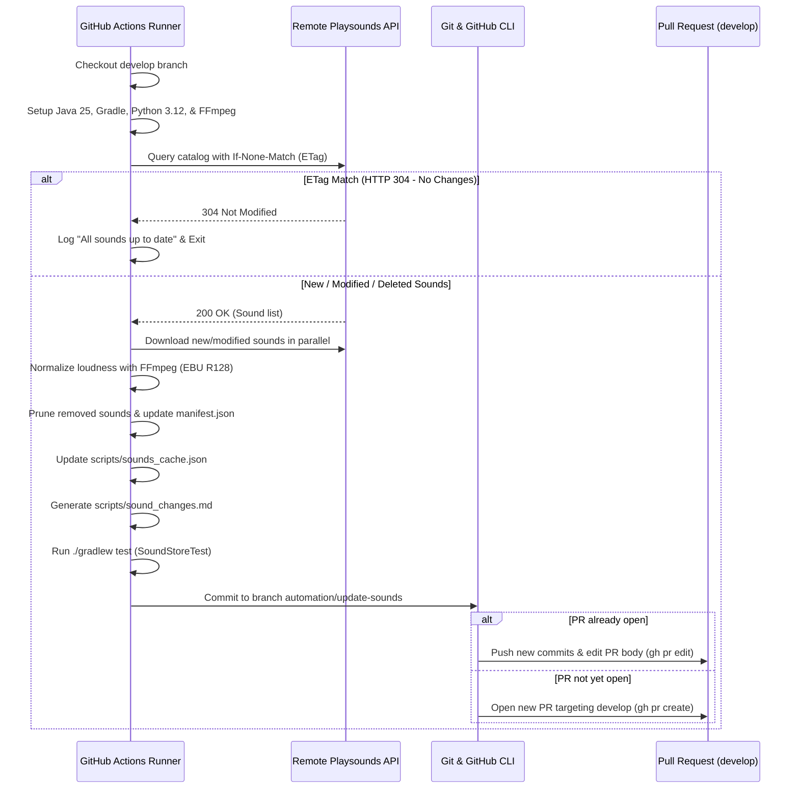

# Sound Synchronization Workflow (`sync-sounds.yml`)

## Overview

The `sync-sounds.yml` workflow automates the synchronization of sound bites from the remote playsounds catalog into the
repository. It runs weekly to detect additions, modifications, or removals, verifies audio and manifest integrity with
automated tests, and creates or updates a Pull Request targeting `develop`.

---

## Triggers

1. **Scheduled (Cron)**:
    - `0 0 * * 0` (Runs automatically every Sunday at 00:00 UTC).
    - *Note*: GitHub Actions only triggers cron schedules from the repository's **default branch** (`main`). Once merged
      into `main`, the schedule activates automatically.

2. **Manual (`workflow_dispatch`)**:
    - Can be triggered manually on-demand from GitHub's **Actions** tab on any branch.
    - **Inputs**:
        - `clean` (*boolean*, default: `false`): When checked, wipes local sound files and cache to force a complete
          re-download and re-conversion of all sounds from the remote catalog.

---

## Repository Requirements

For this workflow to open and update Pull Requests, the repository must have PR creation enabled for GitHub Actions:

1. Navigate to **Settings** > **Actions** > **General**.
2. Scroll to **Workflow permissions**.
3. Check **"Allow GitHub Actions to create and approve pull requests"**.
4. Save changes.

No custom secrets are required. The workflow relies on the built-in `GITHUB_TOKEN` with:

```yaml
permissions:
  contents: write
  pull-requests: write
```

---

## Workflow Steps



### Detailed Steps:

1. **Checkout**: Checks out `develop` using `actions/checkout@v4`.
2. **Environment Setup**:
    - Installs JDK 25 via `actions/setup-java@v4`.
    - Caches Gradle dependencies via `gradle/actions/setup-gradle@v4`.
    - Sets up Python 3.12 via `actions/setup-python@v5`.
    - Installs system `ffmpeg` via `apt-get`.
3. **Execution**:
    - Runs `python scripts/download_sounds.py` (with `--clean` if the manual input is set).
    - Checks for changes. If `scripts/sound_changes.md` was created, changes are present.
4. **Verification**:
    - Executes `./gradlew test --tests com.github.mrbean355.roons.discord.SoundStoreTest` to ensure that every `.mp3`
      file on disk matches `src/main/resources/sounds/manifest.json`.
5. **Pull Request Management**:
    - Force-pushes the updated sounds, manifest, and cache to branch `automation/update-sounds`.
    - Uses `gh pr list` to check if a PR from `automation/update-sounds` to `develop` is already open.
    - If an open PR exists, updates the PR title and description with the latest changelog (`gh pr edit`).
    - If no PR exists, creates a new PR targeting `develop` (`gh pr create`).

---

## File Artifacts

| File                                      | Purpose                                                             | Committed       |
|:------------------------------------------|:--------------------------------------------------------------------|:----------------|
| `src/main/resources/sounds/*.mp3`         | Converted and normalized sound bites                                | Yes             |
| `src/main/resources/sounds/manifest.json` | Sorted JSON array of all active sound bite filenames                | Yes             |
| `scripts/sounds_cache.json`               | API ETag and per-sound `uploadedAt` timestamps for incremental sync | Yes             |
| `scripts/sound_changes.md`                | Ephemeral Markdown changelog used as the PR description             | No (gitignored) |
